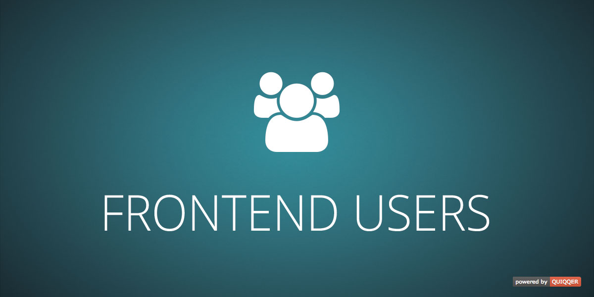

QUIQQER Frontend Users
========

The Frontend Users module extends QUIQQER with a profile extension and a registration for users.

Package Name:

    quiqqer/frontend-users

Features
--------
* API for registration options ("Registrars")
* Default registration option via e-mail (username optional)
* Address form optional for registration
* User activation via e-mail, automatically or by administrator (configurable for each Registrar)
* Password reset
* CAPTCHA for registration (optional via `quiqqer/captcha`)
* Cron that deletes users whose account has not been activated after X days
* Message administrators on new user registration
* Default user groups for newly registered users
* Frontend Profile: Lets users manage their account information
  * Completely customizable via permissions for each profile category
  * Profile categories and sub-categories can be added via `frontend-user.xml` API

Provided site types:
* `login` - Login area with different Authenticators (i.e. `Username / Password`, `Facebook`, `Google`)
* `profile` - Shows a complete user profile to frontend users with different categories, where the user can view and/or change his user data
* `registration` - Shows (configurable) registration options (e.g. `Username / Password`, `Facebook`, `Google`)

*Hint*: All e-mails sent in the registration process currently use the default QUIQQER e-mail templates.

Installation
------------
The Package Name is: quiqqer/frontend-users

Contribute
----------
- Project: https://dev.quiqqer.com/quiqqer/frontend-users
- Issue Tracker: https://dev.quiqqer.com/quiqqer/frontend-users/issues
- Source Code: https://dev.quiqqer.com/quiqqer/frontend-users/tree/master

Support
-------
If you have found errors, wishes or suggestions for improvement,
you can contact us by email at support@pcsg.de.

We will try to meet your needs or send them to the responsible developers
of the project.

License
-------
GPL-3.0+
